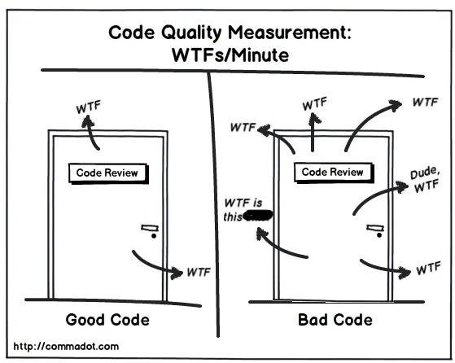

<!-- _paginate: skip -->

# Software Design Patterns

<!-- TODO: find a better title -->
## 🎓 Module 1: Foundations – SOLID Principles for Robust Software Design

---

## Outline

- How to measure software design quality?
- Symptoms of Poorly Designed Software
- How a "well-designed" software becomes "poorly-designed"
- The Copy Example Evolution
- Code Smells and SOLID Principles
- Refactored Code: Applying SOLID
- Final Thoughts

---

## How to measure software design quality?

<!-- _class: lead center -->


---

## What are symptoms of poorly designed software?

<!-- TODO: add link to the poll-->

---

## Symptoms of Poorly Designed Software

<!--TODO: Introduce the book from where these symptoms where taken -->
- Rigidity
- Fragility
- Immobility
- Viscosity
- Needless Complexity
- Needless Repetition
- Opacity

<!-- TODO: Introduce Uncle Bob, link to his website -->

---

## Rigidity

**Definition:**  
Rigidity is the tendency of software to be difficult to change.  
Even small changes can require significant effort and lead to unintended consequences.

- A change in one part requires changes in many others.
- System is tightly coupled, hard to isolate changes.
- Developers avoid changes for fear of breaking things.
- Estimating effort is unreliable.

---

## Fragility

**Definition:**  
Fragility is the tendency of software to break in unexpected ways when changes are made.

- Unintended side effects when modifying code.
- Hard to predict impact of changes.
- Increased debugging and fixing time.

---

## Immobility

**Definition:**  
Immobility is the difficulty of reusing code in different contexts or projects.

- Code is tightly coupled to a specific application.
- Leads to duplication across projects.
- Hard to adapt code for new requirements.

---

## Viscosity

**Definition:**  
Viscosity is the tendency of software to resist change, making it hard to preserve design.

- Quick fixes preferred over proper refactoring.
- Inconsistent design patterns.
- Two forms:
  - **Software Viscosity:** Hard to make design-preserving changes.
  - **Environment Viscosity:** Hard to use the development environment effectively.

---

## Needless Complexity

**Definition:**  
Unnecessary features or overly complicated designs that do not add value.

- Extra, unused code makes system harder to understand and maintain.

---

## Needless Repetition

**Definition:**  
Duplication of code or logic that could be abstracted or reused.

- Increased maintenance effort.
- Higher risk of bugs.
- Harder to understand the system.

---

## Opacity

**Definition:**  
Lack of clarity in the codebase, making it hard to understand.

- Harder onboarding for new developers.
- Difficult debugging and maintenance.
- Confusion about system interactions.

---

## How a "well-designed" software becomes "poorly-designed"

- Poor initial design
- Requirements change
- New features
- Technical debt
- Lack of refactoring
- Company culture
- Team turnover

---

## The Copy Example – 1st Iteration

**Requirements:**  
Read characters from the keyboard until EOF and print them to the printer.

<style>
.container{
    display: flex;
    gap: 1em;
}
.col{
    flex: 1;
}
</style>


<div class="container">

<div class="col">

 ```c++
class Keyboard {
public:
    char readCharacter() { return std::cin.get(); }
};
class Printer {
public:
    void printCharacter(char c) { std::cout << c; }
};
```

</div>

<div class="col">

 ```c++
class Copy {
    Keyboard keyboard_;
    Printer printer_;
public:
    void run() {
        char c;
        while ((c = keyboard_.readCharacter()) != EOF) {
            printer_.printCharacter(c);
        }
    }
};
```

</div>

</div>

---
# The Copy Example – 2nd Iteration


